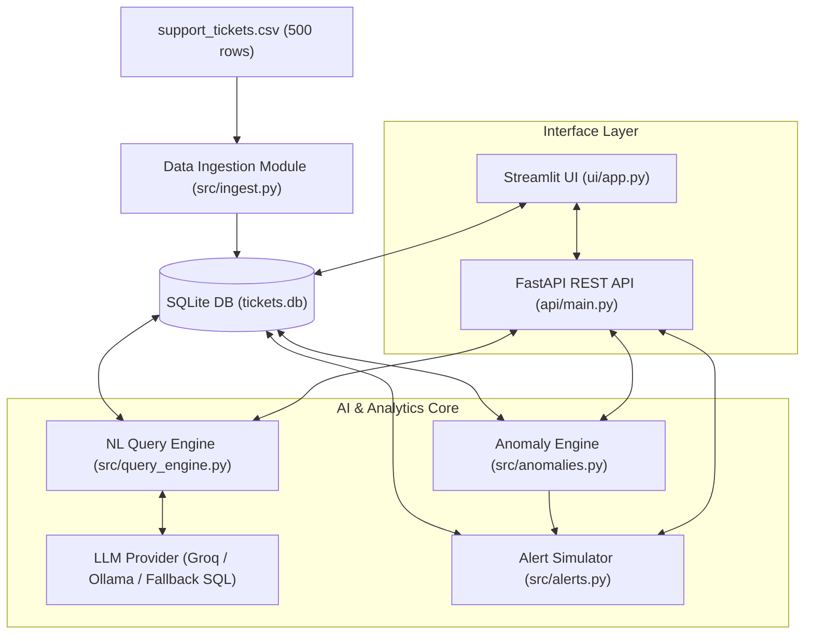

# 🤖 AI-Powered Support Ticket Analytics & Anomaly Detection System

> **DOTMappers IT Technical Assessment — AI Engineer Role**  
> An end-to-end, production-grade AI system that ingests customer support ticket data, enables natural language querying via LLM Text-to-SQL, detects statistical and operational ticket anomalies, dispatches automated Webhook/Email alerts, and exposes functionality through both a **FastAPI REST API** and an **interactive Streamlit Web UI**.

---

## 📌 Executive Summary & Core Capabilities

1. **Data Ingestion & Indexing Pipeline**: Automatically ingests, cleans, normalizes, and indexes `support_tickets.csv` (500 rows) into a structured, read-optimized SQLite database (`tickets.db`).
2. **AI Natural Language Query Engine**: Translates natural language questions into valid SQLite queries using LLMs (Groq Free Tier, Ollama, HuggingFace, OpenAI, or a smart local SQL fallback engine).
3. **Multi-Perspective Anomaly Detection**:
   - **Resolution Time Outliers**: Statistical Interquartile Range (IQR) & Z-score outlier detection per category.
   - **SLA Breaches**: Detects unresolved High/Critical priority tickets open beyond SLA limits (24 hours).
   - **Response Time Spikes**: Flags tickets with abnormally high agent initial response times.
   - **Customer Dissatisfaction Anomalies**: Identifies resolved tickets with low customer ratings ($\le 2$).
4. **Automated Webhook & Alert Simulator**: Formats and dispatches real-time JSON alert payloads (Slack/Teams/PagerDuty compatible) for `CRITICAL` ticket anomalies and maintains an audit trail log.
5. **Dual Interfaces (REST API + Web UI)**:
   - **FastAPI Backend**: Interactive Swagger UI (`/docs`) with `/health`, `/query`, `/anomalies`, `/summary`, `/tickets`, and `/alerts/dispatch-critical` endpoints.
   - **Streamlit Web UI**: Glassmorphic dark dashboard with executive KPIs, live AI query chat, anomaly hub, alert notification panel, and video tutorial user guide.

---

## 🏗️ System Architecture



---

## 🚀 Quickstart & Installation Guide

### Prerequisites
- **Python 3.10+** installed.

### 1. Clone & Set Up Environment

```bash
cd "AI Engineer Assessment"
python -m venv .venv
# Activate virtual environment:
# Windows:
.venv\Scripts\activate
# Linux/macOS:
source .venv/bin/activate

# Install dependencies
pip install -r requirements.txt
```

### 2. Single-Command Launch ⚡

Start both the REST API and Web UI with a single command:

```bash
python run.py
```

- **Streamlit Web UI**: [http://127.0.0.1:8501](http://127.0.0.1:8501)
- **FastAPI REST API**: [http://127.0.0.1:8000](http://127.0.0.1:8000)
- **Interactive OpenAPI Documentation**: [http://127.0.0.1:8000/docs](http://127.0.0.1:8000/docs)

---

## 📡 REST API Documentation

| Endpoint | Method | Description | Example Input / Output |
| :--- | :--- | :--- | :--- |
| `/health` | `GET` | System health & DB connection status | `{"status": "healthy", "total_tickets": 500}` |
| `/query` | `POST` | Execute natural language question | `{"query": "How many tickets are open?"}` |
| `/anomalies` | `GET` | Retrieve detected ticket anomalies | `?severity=CRITICAL&limit=10` |
| `/summary` | `GET` | Aggregate dataset metrics & KPIs | `{"total_tickets": 500, "avg_rating": 3.8}` |
| `/tickets` | `GET` | Paginated ticket search & filtering | `?status=Open&priority=High&page=1` |
| `/alerts/dispatch-critical` | `POST` | Trigger automated Webhook alert dispatch | `{"dispatched_count": 10}` |
| `/alerts/history` | `GET` | Retrieve audit trail of sent alerts | `{"total_logs": 10}` |

---

## 🧪 Running Automated Tests

Run the full PyTest suite (18 tests) to verify all components:

```bash
python -m pytest -v
```
